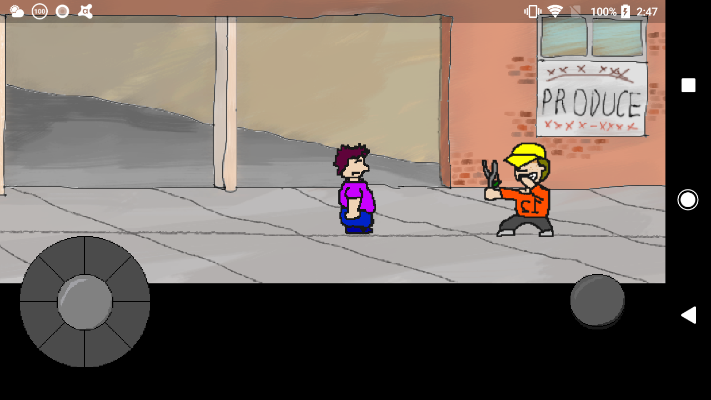
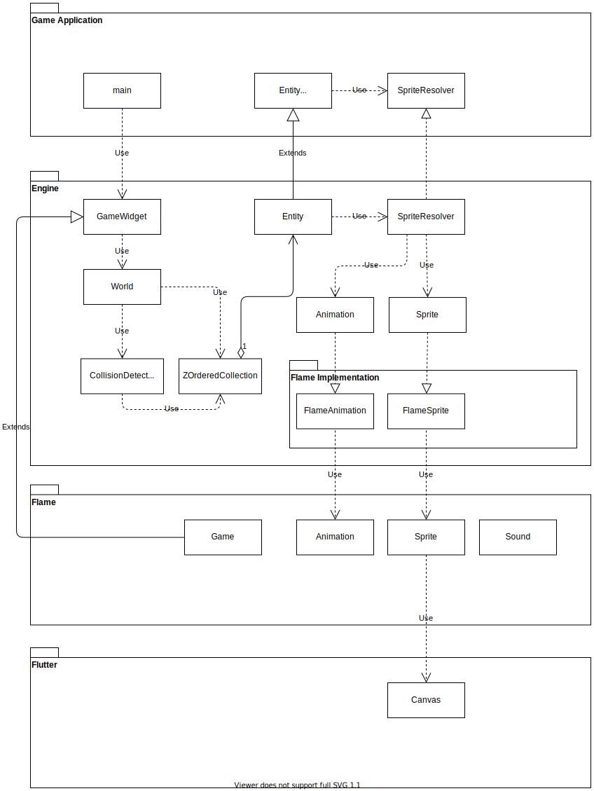

# flame_action

## 概要

[Flame](https://github.com/flame-engine/flame)を使用したアクションゲームのサンプル。

実際に2Dアクションゲームを作成するのに備えてエンジン部分を作ってみるのが目的。

個人の練習用。

## イメージ

## 機能
Flameを利用しながら、くにお君シリーズのような2Dアクションゲームを実装する際に
必要な以下の機能の実装を提供します。
(このプロジェクトは練習用のため、最終的には独立したパッケージとして作り直す予定)

* 奥行きを意識した描画
* 衝突判定
* アニメーションのフレームに応じてイベントを発行する
* 縦方向・横方向同時のジェスチャーへの反応、
    * ユーザー入力をゲームで処理し易い形式に変換(角度と強さ)
* FPS制御
    (Flameでは描画・アニメーションのみFPS制御されるため、ゲームロジックのFPS制御は別途必要)

## 設計

* 以下の実装をEngineのレイヤーで実装、インターフェースを定義しています。
    * 2Dアクションゲーム用のEntityの基本的な動作の定義
    * 奥行きを意識した描画
    * 衝突判定
    * HUDの描画 (図に記載できていない)
    * カメラの概念 (図に記載できていない)
    * アニメーションのフレームに応じたイベントの発行 (図に記載できていない)
    * ユーザーのジェスチャーによる操作の変換 (図に記載できていない)

* アプリケーション側ではEngineを利用し、プレイヤーの動作の定義や、状態に応じて再生するアニメーションの定義の実装を行います。

* 現時点ではFlameを利用していますが、限定的な部分でしか利用していないため、
    将来的に依存しないように変更することを検討しています。
    (現在はゲーム用Widgetの初期化やリソースのロード・管理で利用)

## 実行方法

WIP

## Author

[tri-star](https://github.com/tri-star)
